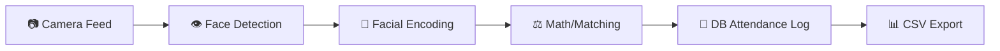

# 🎯 Face Recognition-Based Attendance System


A complete, automated **Face Recognition Attendance System** designed to streamline roll calls and identity verification. By leveraging Computer Vision and Machine Learning, this system captures live video feeds, identifies enrolled users, and securely logs their attendance—eliminating manual entry, saving time, and preventing proxy attendance.

---

## 🎤 Presentation Summary (For Non-Technical Audiences)
Imagine walking into a classroom or office, and instead of scanning an ID card or signing a sheet of paper, the room simply *knows* you are there. This system uses a standard webcam to scan faces in real-time. It converts facial features into a secure digital signature, matches you against its database, and instantly marks you as "Present" with a timestamp. It is fast, secure, touchless, and automatically generates daily Excel-ready reports.

---

## 📦 Tech Stack

- **Python**: Core programming language.
- **OpenCV**: Captures real-time webcam video and provides UI elements (bounding boxes, text overlays).
- **face_recognition (dlib)**: State-of-the-art framework for detecting and extracting 128-d structural encodings of faces.
- **NumPy**: Matrix and array computations for lightning-fast encoding comparisons.
- **Pandas**: Efficient data manipulation for writing robust CSV reports.
- **SQLite**: Local relational database handling persistence safely and preventing duplicate entries.

---

## ✨ Features

- ✅ **Face Registration:** Easily enroll new students using the built-in webcam capture flow.
- ✅ **Real-Time Detection & Recognition:** Tracks faces and verifies identity via dynamic confidence scoring.
- ✅ **Automatic Attendance Marking:** Securely executes SQL inserts mapping Identity, Date, and Time.
- ✅ **Duplicate Prevention:** Strict database constraints ensure users are only logged *once* per day.
- ✅ **CSV Report Generation:** Instantly exports daily or monthly attendance records for stakeholders.
- ✅ **Polished CLI Interface:** An intuitive, menu-driven command-line terminal for seamless operation.

---

## 🧠 System Flow



---

## 📁 Folder Structure

```text
├── attendance/          # 📊 Exported CSV files (Daily/Monthly reports)
├── database/            # 💽 SQLite DB instances (e.g., attendance.db)
├── dataset/             # 🖼️ Raw student images organized by name
├── encodings/           # 📦 Saved serialized globally mapped face vectors
├── src/                 # ⚙️ Core system logic
│   ├── attendance_manager.py  # Handles SQL transactions and Pandas CSV compilation
│   ├── capture.py             # Seamless webcam photo enrollment
│   ├── database.py            # Normalized initialization of Student/Attendance tables
│   ├── detector.py            # Real-time multi-threading video processing loop
│   └── encoder.py             # Feature extraction modeling 
├── main.py              # 🚀 Central Command-Line menu
└── requirements.txt     # 📚 Dependencies needed to run
```

---

## 🛠️ Installation Guide

Follow these steps to configure your environment:

### 1. Prerequisites
Ensure you have Python 3.8+ installed. 
*Note: Installing `dlib` requires C++ build tools.*
- **Windows:** Install Visual Studio Build Tools.
- **Linux/macOS:** Run `sudo apt-get install cmake gcc g++`

### 2. Clone the Repository
```bash
git clone https://github.com/yourusername/face-recognition-attendance.git
cd face-recognition-attendance
```

### 3. Install Required Packages
```bash
pip install -r requirements.txt
```

---

## ▶️ Usage Guide

To fire up the system, simply run:
```bash
python main.py
```
You will be greeted with the main operating menu.

### How to use the options:
1. **Register Student (Option 1):** Type the student's name. Look at the camera. The system will automatically take 5 photos and covert them into structural encodings.
2. **Start Attendance (Option 2):** Opens the live feed. Step into the frame. The system will draw a bounding box around your face, display your name with a confidence score, and record your attendance in the background. Press `q` to exit.
3. **View Attendance (Option 3):** Automatically fetches all the underlying SQLite records and compiles them into fresh, reading-friendly `CSV` files located in the `/attendance` folder.

---

## 🧪 Demo Flow (For Live Presentations)

If you are demoing this for a client or class project, follow this exact fluid script:

1. **Before the Demo:** Ensure your environment is set up and `python main.py` is running.
2. **Step 1:** Explain that you are registering a new user. Hit `1` and enter your name (e.g., "JohnDoe"). Show the camera capturing multiple angles. Explain that it is creating a mapping vector, not just saving a picture.
3. **Step 2:** Hit `2` to start the live attendance screen. Move in and out of the camera. Point out the **Confidence Percentage** score, the **Timestamp** on your bounding box, and the **System Time** ticking in the corner.
4. **Step 3:** Explain that the system avoids spamming the log. Even though you are standing there, it only logs you *once* per day. (Close camera with `q`).
5. **Step 4:** Hit `3` to instantly generate reports. Open the `/attendance` folder on screen and click into the resulting `CSV` file to prove data validation.

---

## 📊 Sample Output (CSV Format)

Here is exactly what the system exports when requested (e.g., `attendance/daily_report_2026-03-31.csv`):

| id | name | date | time |
| :---: | :--- | :---: | :---: |
| 1 | JohnDoe | 2026-03-31 | 09:12:45 |
| 2 | JaneSmith | 2026-03-31 | 09:14:10 |
| 3 | Admin | 2026-03-31 | 09:47:22 |

---

## ⚠️ Edge Cases Handled

- 🎭 **Unknown Faces:** If a face similarity score falls below the 55% strict threshold, the bounding box turns RED and registers as "Unknown." No attendance is logged.
- 🔁 **Duplicate Attendance:** Mitigated completely via SQlite `UNIQUE(name, date)` constraints. The system silently catches duplicate triggers.
- 📸 **Camera Failsafes:** System halts and warns users cleanly if a Webcam index is blocked or unavailable, rather than crashing unpredictably.
- 📂 **Empty Dataset Booting:** Trying to process Live Attendance without first registering a user securely alerts the admin to register users first.

---

## 🚀 Future Improvements

- [ ] **Web Dashboard:** Migrate from CLI to a streamlined Flask/Django or React Admin portal for easier remote access.
- [ ] **Cloud Database:** Connect SQLite schema to a unified remote PostgreSQL or Firebase instance.
- [ ] **Mobile App App:** Create an Android/iOS companion app for users to check their monthly attendance logs.
- [ ] **Liveness Detection:** Incorporate eye-blink or head-turn parameters to ensure people cannot fool the camera using printed photographs.

---

_Built with ❤️ using Python AI Frameworks._
